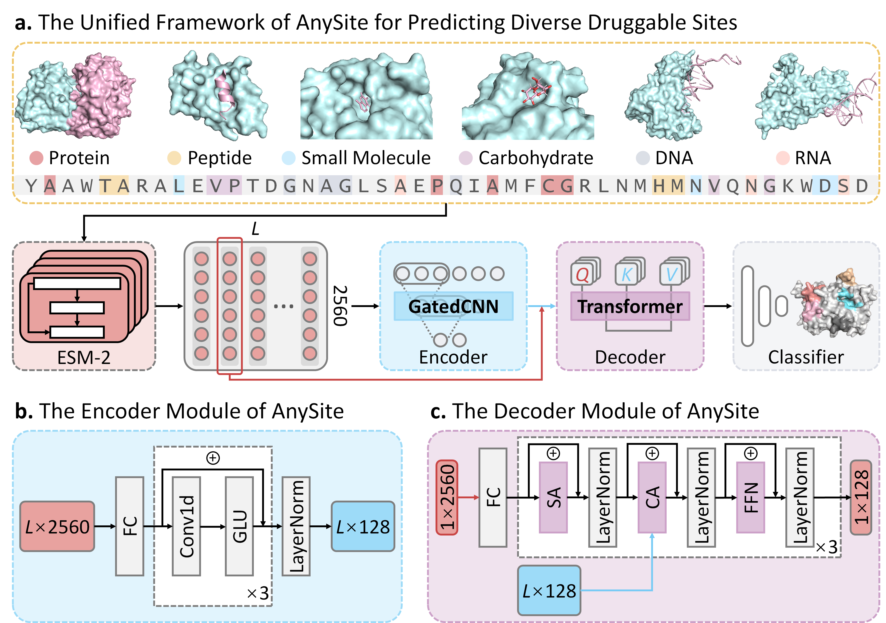

# Protein Binding Site Predictor

A deep learning framework for predicting protein binding sites using transformer-based architecture with convolutional encoders and attention mechanisms.

## Overview

This project implements a protein binding site prediction model that combines:
- **Convolutional Encoder**: Extracts local protein features using 1D convolutions with GLU activation
- **Transformer Decoder**: Processes features using multi-head attention mechanisms
- **RAdam + Lookahead Optimization**: Advanced optimization strategy for better convergence
- **ESMFold Embeddings**: Uses pre-computed protein embeddings for feature representation
    
## Architecture

```
Input Protein → Encoder → Decoder → Classification Head
     ↓             ↓         ↓            ↓
ESMFold        Conv1D +   Multi-head   Binary
Embeddings     GLU       Attention   Classification
(2560D)      (Residual)  (Cross +     (Binding/
                         Self)      Non-binding)
```

## Project Structure

```
AnySite/
├── src/
│   ├── models/
│   │   ├── model.py           # Main model architecture
│   │   ├── radam.py           # RAdam optimizer
│   │   └── lookahead.py       # Lookahead optimizer wrapper
│   ├── data/
│   │   └── data_generator.py  # Data loading and preprocessing
│   ├── utils/
│   │   ├── helpers.py         # Utility functions
│   │   └── metrics.py         # Evaluation metrics
│   └── optimizers/            # Alternative optimizer location
├── configs/
│   └── config.yaml           # Training configuration
├── data/                     # Data directory
├── logs/                     # Training logs
├── models/                   # Saved model checkpoints
├── results/                  # Evaluation results
├── train.py                  # Training script
├── predict.py               # Prediction script
├── preprocess.py            # Data preprocessing
└── README.md               # This file
```

## Requirements

### Dependencies
```bash
# Core dependencies
torch>=1.12.0
numpy>=1.21.0
scikit-learn>=1.0.0
pyyaml>=6.0
pandas>=1.3.0

# Optional for distributed training
torch.distributed

# For data processing
pickle
pathlib
```

### Hardware
- **GPU**: NVIDIA GPU with CUDA support (recommended)
- **Memory**: 16GB+ RAM, 8GB+ GPU memory
- **Storage**: 10GB+ for data and models

## Installation

1. **Clone the repository**:
```bash
git clone <repository-url>
cd AnySite
```

2. **Create conda environment**:
```bash
conda create -n protein_prediction python=3.10
conda activate protein_prediction
```

3. **Install dependencies**:
```bash
pip install torch torchvision torchaudio --index-url https://download.pytorch.org/whl/cu118
pip install numpy scikit-learn pyyaml pandas
```

4. **Verify installation**:
```bash
python -c "import torch; print(f'PyTorch version: {torch.__version__}'); print(f'CUDA available: {torch.cuda.is_available()}')"
```

## Data Format

### Input Files
The model expects three pickle files for each dataset split:

1. **ESMFold Embeddings** (`*_ESMFold.pkl`):
   - List of protein embeddings
   - Each protein: `List[List[float]]` with shape `[seq_len, 2560]`

2. **Labels** (`*_label.pkl`):
   - List of binding site labels
   - Each protein: `List[int]` with 0/1 labels for each residue

3. **Index List** (`*_list.pkl`):
   - Protein metadata
   - Format: `[(count, id_idx, position, dataset, protein_id, seq_length), ...]`

### Data Preparation
```bash
# Preprocess FASTA files (example)
python preprocess.py --input protein_sequences.fasta --output data/processed --split train

# Expected file structure:
data/
├── train/
│   ├── Com_Train_1628_ESMFold.pkl
│   ├── Com_Train_1628_label.pkl
│   └── Com_Train_1628_list.pkl
├── valid/
│   └── ...
└── test/
    └── ...
```

## Configuration

Edit `configs/config.yaml` to customize training:

```yaml
data:
  train_path: "data/train/"
  valid_path: "data/valid/"
  test_path: "data/test/"
  window_size: 0            # Context window (0 = no windowing)
  local_dim: 2560          # ESMFold embedding dimension
  protein_dim: 2560        # Protein feature dimension

model:
  hidden_dim: 256          # Hidden layer dimension
  n_layers: 6              # Number of encoder/decoder layers
  n_heads: 8               # Multi-head attention heads
  pf_dim: 512             # Feedforward dimension
  dropout: 0.1             # Dropout rate
  kernel_size: 3           # Convolution kernel size

training:
  batch_size: 32           # Batch size
  learning_rate: 0.001     # Initial learning rate
  weight_decay: 0.0001     # L2 regularization
  epochs: 100              # Maximum epochs
  early_stopping: 10       # Early stopping patience
  decay_interval: 10       # LR decay frequency
  lr_decay: 0.9           # LR decay factor
  seed: 42                # Random seed
```

## Training

### Basic Training
```bash
python train.py --config configs/config.yaml
```

### Background Training
```bash
# Simple background execution
nohup python train.py --config configs/config.yaml > train.log 2>&1 &

# Or use the provided script
./run_training.sh
```

### Distributed Training
```bash
# Multi-GPU training
python -m torch.distributed.launch --nproc_per_node=2 train.py --config configs/config.yaml --distributed
```

### Monitor Training
```bash
# View training progress
tail -f train.log

# Monitor GPU usage
nvidia-smi

# View training metrics
tail -f results/output-*.txt
```

## Prediction

### Single Protein Prediction
```bash
python predict.py \
    --model models/best_model.pth \
    --config configs/config.yaml \
    --input data/test_protein.fasta \
    --output predictions/ \
    --threshold 0.3
```

### Batch Prediction
```bash
python predict.py \
    --model models/best_model.pth \
    --config configs/config.yaml \
    --input data/test_dataset/ \
    --output predictions/ \
    --batch_size 64
```

## Model Architecture Details

### Encoder (Convolutional)
- **Input**: ESMFold embeddings `[batch, seq_len, 2560]`
- **Layers**: Multiple 1D Conv + GLU + Residual connections
- **Output**: Encoded features `[batch, seq_len, hidden_dim]`

### Decoder (Transformer)
- **Self-Attention**: Processes local features
- **Cross-Attention**: Attends to encoded protein features
- **Output**: Classification logits `[batch, 2]`

### Optimization
- **Primary**: RAdam optimizer with adaptive learning rates
- **Meta**: Lookahead wrapper for improved convergence
- **Regularization**: Weight decay + dropout

## Evaluation Metrics

The model reports comprehensive evaluation metrics:

- **ACC**: Accuracy
- **AUC**: Area Under ROC Curve
- **Rec**: Recall (Sensitivity)
- **Pre**: Precision
- **F1**: F1-Score
- **MCC**: Matthews Correlation Coefficient
- **PRC**: Precision-Recall Curve AUC

## Results

Training outputs are saved to:
- **Models**: `models/best_model.pth`
- **Metrics**: `results/output-*.txt`
- **Logs**: `logs/train_*.log`

Example results format:
```
Epoch	Time1(sec)	Time2(sec)	Loss_train	ACC_dev	AUC_dev	Rec_dev	Pre_dev	F1_dev	MCC_dev	PRC_dev	ACC_test	AUC_test	Rec_test	Pre_test	F1_test	MCC_test	PRC_test
1	45.2	12.3	0.642	0.723	0.801	0.675	0.782	0.724	0.456	0.789	0.718	0.795	0.681	0.771	0.721	0.442	0.783
```

## Troubleshooting

### Common Issues

1. **CUDA Out of Memory**:
   ```bash
   # Reduce batch size in config.yaml
   batch_size: 16  # or smaller
   ```

2. **Data Loading Errors**:
   ```bash
   # Check data file format
   python -c "import pickle; print(len(pickle.load(open('data.pkl', 'rb'))))"
   ```

3. **Import Errors**:
   ```bash
   # Add project to Python path
   export PYTHONPATH="${PYTHONPATH}:/path/to/AnySite"
   ```

4. **NumPy Version Issues**:
   ```bash
   # Update NumPy if you see np.long errors
   pip install numpy>=1.21.0
   ```

### Debug Mode
```bash
# Enable debug logging
python train.py --config configs/config.yaml --debug
```

## Performance Tips

1. **Data Loading**: Use `num_workers=4` for faster data loading
2. **Memory**: Enable gradient checkpointing for large models
3. **Speed**: Use mixed precision training with `autocast()`
4. **Distributed**: Scale learning rate linearly with number of GPUs

## License

This project is licensed under the MIT License - see the LICENSE file for details.

## Contributing

1. Fork the repository
2. Create a feature branch (`git checkout -b feature/new-feature`)
3. Commit changes (`git commit -am 'Add new feature'`)
4. Push to branch (`git push origin feature/new-feature`)
5. Create a Pull Request


## Acknowledgments

- ESMFold for protein embeddings
- PyTorch team for the deep learning framework
- Scientific Python community for tools and libraries
